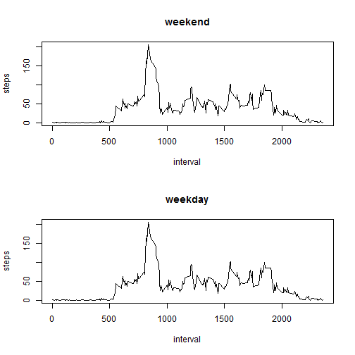

Loading and preprocessing the data
=====================================================================

First we load the data file: 
    

```r
activity <- read.csv("./activity.csv", stringsAsFactors=FALSE)
```
    
Second, we display the first few rows of the activity data file:
 

```
##   steps       date interval
## 1    NA 2012-10-01        0
## 2    NA 2012-10-01        5
## 3    NA 2012-10-01       10
## 4    NA 2012-10-01       15
## 5    NA 2012-10-01       20
## 6    NA 2012-10-01       25
```

Following we display the activity file names: 

```
## [1] "steps"    "date"     "interval"
```
  
What is mean total number of steps taken per day?
=====================================================================

We calculate the total number of steps taken per day:
 

```r
steps.date <- aggregate(steps ~ date, data = activity, FUN = sum)
```
 
We make a histogram of the total number of steps taken each day:


```r
barplot(steps.date$steps, names.arg = steps.date$date, xlab = "date", ylab = "steps")
```

 

Then we calculate and report the mean and median of the total number of steps taken per day:

```r
mean(steps.date$steps)
```

```
## [1] 10766.19
```


```r
median(steps.date$steps)
```

```
## [1] 10765
```

What is the average daily activity pattern?
=====================================================================

We make a time series plot of the 5-minute interval (x-axis) and the average number of steps taken, averaged across all days (y-axis):


```r
steps.interval <- aggregate(steps ~ interval, data = activity, FUN = mean)
plot(steps.interval, type = "l")
```

 

Then we calculate a 5-minute interval that, on average across all the days in the dataset, contains the maximum number of steps:


```r
steps.interval$interval[which.max(steps.interval$steps)]
```

```
## [1] 835
```

Imputing missing values
=====================================================================

We calculate and report the total number of missing values in the dataset:


```r
sum(is.na(activity))
```

```
## [1] 2304
```

We devise a strategy for filling in all of the missing values in the dataset. For this we will use the means for the 5-minute intervals. 

Next, we create a new dataset that is equal to the original dataset but with the missing data filled in:


```r
activity <- merge(activity, steps.interval, by = "interval", suffixes = c("", 
    ".y"))
nas <- is.na(activity$steps)
activity$steps[nas] <- activity$steps.y[nas]
activity <- activity[, c(1:3)]
```

Following we make a histogram of the total number of steps taken each day:  


```r
steps.date <- aggregate(steps ~ date, data = activity, FUN = sum)
barplot(steps.date$steps, names.arg = steps.date$date, xlab = "date", ylab = "steps")
```

 

Finally, we calculate and report the mean and median total number of steps taken per day. We observe that these values do not greatly differ from the estimates from the first part of the assignment:  


```r
mean(steps.date$steps)
```

```
## [1] 10766.19
```


```r
median(steps.date$steps)
```

```
## [1] 10766.19
```

Thus, the impact of the missing data is rather low when estimating the total number of steps per day.

Are there differences in activity patterns between weekdays and weekends?
=====================================================================

We create a new factor variable in the dataset with two levels - "weekday" and "weekend" indicating whether a given date is a weekday or weekend day:


```r
daytype <- function(date) {
    if (weekdays(as.Date(date)) %in% c("Saturday", "Sunday")) {
        "weekend"
    } else {
        "weekday"
    }
}
activity$daytype <- as.factor(sapply(activity$date, daytype))
```

Finally, we make a panel plot containing a time series plot (i.e. type = "l") of the 5-minute interval (x-axis) and the average number of steps taken, averaged across all weekday days or weekend days (y-axis):


```r
par(mfrow=c(2,1))
for (type in c("weekend", "weekday")) {
    steps.type <- aggregate(steps ~ interval,
                            data= activity,
                            subset= activity$daytype == daytype,
                            FUN= mean)
    plot(steps.type, type="l", main=type)
}
```

 
